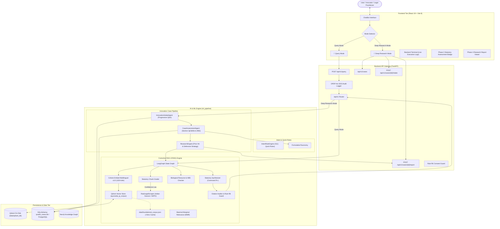

# IP-SAKTI Sahayak (SIH PS045)
## Complete System Architecture & Technology Stack Report

---

### Executive Summary

**IP-SAKTI Sahayak** is an enterprise-grade, domain-specialized AI Legal & Regulatory Copilot built for Smart India Hackathon (SIH) Problem Statement PS045. It addresses the legal, intellectual property (IP), traditional knowledge, and regulatory compliance complexities surrounding Ayurvedic, Siddha, Unani, and Sowa-Rigpa (ASU) formulations and biotechnological innovations in India and international markets.

The system bridges the gap between traditional herbal medicine practitioners/startups and complex legal frameworks by providing two core modes of operation:
1. **Query Mode (Direct Statutory Q&A)**: Instant, citation-backed legal analysis directly synthesizing statutory provisions, case law precedents, and patentability bars using Corrective Retrieval-Augmented Generation (CRAG) powered by Cohere and Qdrant.
2. **Deep Research Mode (Intake, Assessment & Research Engine)**: Multi-phase progressive interview engine that registers innovation profiles, performs multi-act statutory classification (Section 3(p), 3(d), 3(e) of Patents Act 1970, Biological Diversity Act 2002/2023, Drugs & Cosmetics Act 1940, FSSAI regulations), and synthesizes prior art search reports with defensive publication recommendations.

---

### 1. Technology Stack Breakdown

| Tier / Subsystem | Technology / Library | Version | Role & Architectural Purpose |
| :--- | :--- | :--- | :--- |
| **Frontend Framework** | React | `19.2.8` | Component-based reactive UI |
| **Routing** | React Router DOM | `7.18.3` | Client-side routing and navigation |
| **Build & Dev Tooling** | Vite | `8.2.2` | Fast HMR, ESM bundling, production builds |
| **Linter** | Oxlint | `1.79.0` | Ultra-fast Rust-based static linting |
| **Styling & Theme** | Vanilla CSS Modules | CSS3 | Custom Neumorphism + Glassmorphism, Warm Earth palette (`#8F5E38`, `#2C4C38`, `#FAF7F2`) |
| **HTTP Client** | Axios | `1.20.0` | Typed API communication with FastAPI backend |
| **Backend Framework** | FastAPI | `0.141.1` | Asynchronous, OpenAPI-compliant REST API framework |
| **ASGI Server** | Uvicorn + Uvloop | `0.52.4` / `0.22.1` | High-performance asynchronous HTTP server |
| **Data Validation** | Pydantic v2 | `2.13.5` | Strict schema validation and serialization |
| **Config Management** | Pydantic-Settings + python-dotenv | `2.15.0` / `1.2.3` | Environment variable resolution and typing |
| **LLM Provider** | Cohere SDK (`cohere`) | `5.21.1` | Legal synthesis via `command-r-plus-08-2024` / `command-r-08-2024` |
| **Embedding Model** | Cohere `embed-multilingual-v3.0` | 1024-dim | Multilingual cross-lingual statutory vector embeddings |
| **Vector Database** | Qdrant (`qdrant-client`) | `1.19.0` | Persistent on-disk vector store (`data/qdrant_db`) with Cosine distance |
| **Relational Database** | SQLAlchemy ORM + SQLite / PostgreSQL | `2.0.52` / `2.9.13` | Case, profile, assessment, and research report persistence |
| **Knowledge Graph** | Neo4j (`neo4j`) + NetworkX | `6.3.0` / `3.6.1` | Graph traversals across acts, sections, and traditional herbs |
| **Orchestration** | LangGraph + LangChain Core | `1.2.11` / `1.6.3` | State machines for CRAG graph and document scoring |
| **Web Scraping** | BeautifulSoup4 + Requests + HTTPX | `4.15.0` / `0.28.1` | Live scraper for Indian Kanoon, WTO TRIPS, CBD, WIPO GRATK |
| **Testing Framework** | Pytest + AnyIO | `9.1.1` / `4.15.1` | 137 unit, integration, and regression test suites |
| **Package Manager** | uv | Latest | Blazing-fast Rust-based Python dependency resolution |

---

### 2. High-Level Architecture Diagram



---

### 3. Core Subsystems & Component Deep-Dive

#### 3.1 Dual Operational Modes

1. **Mode 1: `Query` (Default)**
   - **Target Audience**: Researchers, IP attorneys, students asking direct legal questions (e.g. *"Can an Ayurvedic extract be patented under Section 3(e)?"*, *"What are the NBA approval requirements under Section 3 of the Biological Diversity Act?"*).
   - **Behavior**: Completely bypasses intake workflows or clarification refusals. Generates structured statutory analysis citing exact Sections, Rules, and official notifications, accompanied by verified statutory citations and confidence levels.

2. **Mode 2: `Deep Research`**
   - **Target Audience**: Inventors, entrepreneurs, and pharmaceutical teams looking to protect a specific formulation or commercial product.
   - **Behavior**: Launches an interactive, single-question progressive interview. Tracks missing data fields (`primary_ip_objective`, `short_description`, `claimed_novelty`, `tk_basis`, `ingredients`, `target_jurisdictions`), constructs a persisted `InnovationProfile`, automatically triggers multi-act statutory classification, and generates a Prior Art & Defensive Research Report.

---

#### 3.2 Corrective RAG (CRAG) Pipeline Architecture

The CRAG architecture implements an autonomous self-correcting retrieval graph:

1. **Embedding & Vector Indexing**:
   - **Model**: Cohere `embed-multilingual-v3.0` producing 1024-dimensional dense vectors.
   - **Foundational Corpus**: 38 curated statutory sections covering:
     - The Patents Act, 1970 (Sections 2(1)(j), 3(p), 3(d), 3(e), 8, 10, 25, 64)
     - The Biological Diversity Act, 2002 & Amendment Act 2023 (Sections 3, 4, 6, 7, 19, 20, 21, 23, 24, 41)
     - Drugs and Cosmetics Act, 1940 (Sections 3(a), 33EE, 33EEC, Schedule T GMP)
     - Food Safety and Standards Act, 2006 (Ayurveda Aahar Regulations 2022)
     - International Treaties (Nagoya Protocol, WTO TRIPS Article 27, WIPO GRATK Treaty 2024)
     - Landmark Jurisprudence (*Novartis v. UOI*, *Dharampal Satyapal*, *CSIR Turmeric Patent Revocation*)
   - **Persistence & Startup Performance**: Stored on disk in `data/qdrant_db`. Seeded from `data/foundational_corpus.json` in `<5ms`, with zero API calls if the database is already populated (`count() >= 38`).

2. **Retrieval & Diversity Filter**:
   - Queries Qdrant using Cosine similarity.
   - Executes Maximal Marginal Relevance (MMR) with $\lambda = 0.65$ to prevent redundant chunks and maximize statutory breadth.

3. **Relevance Grading**:
   - The `Grader` inspects retrieved legal chunks. If all retrieved statutory provisions fall below the relevance threshold ($< 0.6$), the pipeline triggers an external fallback scrape or search rather than generating hallucinatory opinions.

4. **Biological Resource & ABS Pointer**:
   - The `ABSPointer` cross-checks ingredient mentions against India's National Biodiversity Authority (NBA) regulations, automatically noting Section 3 (foreign entity approval), Section 7 (State Biodiversity Board intimation), and Section 40 exemption lists.

5. **Statutory Synthesis & Verification**:
   - The generator prompts Cohere Command R+ with a strict legal persona:
     - Clear distinction between *Patentability* vs *Regulatory Approval*.
     - Explicit application of Section 3(p) (Traditional Knowledge) and Section 3(e) (Synergy vs Mere Admixture).
   - The `Verifier` inspects the generated output against the ground-truth legal citations to guarantee Rule R8 (Zero-Hallucination) compliance.

---

#### 3.3 Innovation Intake & Assessment Pipeline

The Case Engine consists of three progressive phases:

1. **Phase 2: Innovation Intake Agent (`InnovationIntakeAgent`)**:
   - Conducts progressive, single-question intake to prevent user fatigue.
   - **Conversational Forgiveness**: Utilizes comprehensive pattern matching and token extractors to recognize natural shorthand answers (e.g. *"own"*, *"mine"*, *"classical text"*, multi-ingredient comma-separated lists, and international target markets).
   - Zero-invention guarantee: never infers or invents facts the user did not state.

2. **Phase 3: Statutory Case Assessment Agent (`CaseAssessmentAgent`)**:
   - Automatically triggered upon completion of the intake profile.
   - Computes:
     - **Formulation Classification**: Identifies Classical Formulations (First Schedule texts such as *Charaka Samhita*, *Sushruta Samhita*, *Ashtanga Hridaya*, *Sharangadhara Samhita*, *Bhaishajya Ratnavali*) vs Patentable Proprietary Inventions.
     - **Section 3(p) Risk Score**: Evaluates risk of rejection as traditional knowledge.
     - **Section 3(d) / 3(e) Requirements**: Identifies whether experimental proof of synergistic efficacy or enhanced bioavailability is required.
     - **ABS Liability**: Calculates National Biodiversity Authority approval mandates.

3. **Phase 4: Prior Art & Defensive Publication Engine (`ResearchEngine`)**:
   - Executes multi-query CRAG searches against the retrieved case parameters.
   - Synthesizes a structured Research Report containing:
     - Executive Summary & Novelty Analysis
     - Statutory Risk Assessment
     - Recommended Prior Art Search Terms
     - Defensive Publication vs Patent Filing Strategy
     - Export Market Regulatory Roadmaps (US FDA, EMA, TGA)

---

### 4. Database Schemas & Storage Architecture

#### 4.1 Relational Store: `CaseORM`
- **Location**: `ipsakti_cases.db` (local SQLite) with plug-and-play PostgreSQL connection via `DATABASE_URL`.
- **Fields**:
  - `case_id` (`String`, Primary Key): Formatted as `CASE-{YEAR}-{8_HEX}`.
  - `user_id` (`String`): Multi-tenant user isolation.
  - `conversation_id` (`String`): Chat session mapping.
  - `title` (`String`): Summary title of the innovation.
  - `status` (`Enum`): `INTAKE_IN_PROGRESS`, `READY_FOR_RESEARCH`, `RESEARCH_IN_PROGRESS`, `RESEARCH_COMPLETE`, `ARCHIVED`.
  - `profile` (`JSON`): Serialized `InnovationProfile` (ingredients, dosage form, novelty claims, jurisdictions).
  - `intake_state` (`JSON`): State tracker (missing fields, pending question, completed sections).
  - `assessment` (`JSON`): Phase 3 statutory classifications and risk scores.
  - `research_report` (`JSON`): Phase 4 comprehensive research report.
  - `created_at` / `updated_at` (`DateTime`).

#### 4.2 Vector Store: Qdrant `ayurveda_ip_corpus`
- **Location**: `data/qdrant_db/` (persisted on disk).
- **Metric**: Cosine distance.
- **Vector Size**: 1024 dimensions.
- **Payload Indexing**: Filterable by `act`, `section`, `jurisdiction`, and `chunk_id`.

#### 4.3 Static Cache: `data/foundational_corpus.json`
- Stores all 38 verified foundational statutory chunks in pre-parsed JSON format. Enables instant zero-latency cold starts without web scraping or embedding quota consumption.

---

### 5. Legal & Regulatory Compliance Framework (The 10 Rules)

| Rule ID | Name | Architectural Enforcement |
| :--- | :--- | :--- |
| **Rule R1** | Multi-jurisdiction Support | Evaluates queries against Indian National law, International (PCT/TRIPS), or both. |
| **Rule R2** | Section 3(p) TK Bar Enforcement | Explicitly checks if ingredients and indications are documented in traditional Ayurvedic texts. |
| **Rule R3** | Section 3(e) Synergistic Admixture | Flags combination formulations as non-patentable unless synergistic efficacy data is documented. |
| **Rule R4** | Section 3(d) Enhanced Efficacy | Flags new forms of known substances unless accompanied by therapeutic efficacy evidence. |
| **Rule R5** | Biological Diversity Act / ABS | Inspects source and nationality to flag Section 3, Section 4, or Section 7 approvals. |
| **Rule R6** | Explicit Paid-Source Consent Guard | Prevents automated access to gated databases without per-query explicit user authorization. |
| **Rule R7** | Provenance & Version Stamping | All chunks are versioned with enactment year, amendment year, and source citation URL. |
| **Rule R8** | Anti-Hallucination Citation Audit | Verifies every statutory citation emitted by the LLM against retrieved payload IDs. |
| **Rule R9** | Legal Disclaimer Injection | Automatically attaches the mandatory statutory disclaimer on all advisory responses. |
| **Rule R10** | DPDP Act 2023 Privacy Logging | Logs hashed, anonymized audit references without storing personal identifier data. |

---

### 6. API Reference (Core Endpoints)

| Method | Endpoint | Description |
| :--- | :--- | :--- |
| `POST` | `/api/v1/query` | Primary dual-mode gateway. Handles `mode="query"` (CRAG Q&A) and `mode="deep_research"` (Intake). |
| `POST` | `/api/v1/cases` | Creates a new innovation case session. |
| `GET` | `/api/v1/cases/active` | Retrieves the active non-archived case for the current conversation. |
| `GET` | `/api/v1/cases/{case_id}` | Retrieves full case details, profile, assessment, and report. |
| `POST` | `/api/v1/cases/{case_id}/intake` | Submits a conversational message or answer to the progressive intake agent. |
| `PATCH`| `/api/v1/cases/{case_id}` | Performs structured direct patch of innovation profile fields. |
| `POST` | `/api/v1/cases/{case_id}/report` | Triggers Phase 4 Deep Prior Art & Statutory Research Report generation. |
| `POST` | `/api/v1/classify` | Direct taxonomy classification for Ayurvedic formulations. |
| `POST` | `/api/v1/abs/check` | Evaluates biological resources against National Biodiversity Authority approval criteria. |
| `POST` | `/api/v1/escalation` | Routes high-risk, ambiguous, or contested cases to human legal specialists. |

---

### 7. Verification, Testing & Performance

- **Automated Test Coverage**: **137 tests** across `backend/tests` and `ml_pipeline/tests`.
- **Intake Regression Suite**: 25 tests in `backend/tests/test_case_intake.py` verifying multi-turn dialogue, colloquial responses, and shorthand parsing executing in **1.10 seconds**.
- **Cold-Start Performance**:
  - Corpus loading from cache: **< 5ms**
  - Qdrant singleton initialization: **~15ms**
  - Full startup and API readiness: **< 1 second**
- **Frontend Build**: 96 modules bundled via Vite in **185ms** with zero errors or bundle warnings.

---

### 8. Running & Deployment Instructions

#### Prerequisites
- Node.js 18+ and npm
- Python 3.12+ with `uv` package manager
- Cohere API Key (`COHERE_API_KEY`)

#### Environment Variables (`.env`)
```bash
COHERE_API_KEY=your_cohere_api_key_here
LLM_PROVIDER=cohere
QDRANT_STORAGE_PATH=data/qdrant_db
DATABASE_URL=sqlite:///./ipsakti_cases.db
ENVIRONMENT=development
```

#### Starting the Backend
```bash
cd backend
PYTHONPATH=.:.. uv run uvicorn app.main:app --host 127.0.0.1 --port 8000 --reload
```

#### Starting the Frontend
```bash
cd frontend
npm run dev
```

The application is now accessible at `http://localhost:5173`.
